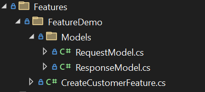

Now that we have a properly functioning project with all relevant service registrations, we can proceed with the creation of a new feature.

A "feature," as the term implies, represents a distinct aspect or functionality within the project, akin to a small piece in a larger puzzle.

The framework we're utilizing doesn't prescribe a specific folder structure or naming convention; these choices are left to your discretion. However, it does mandate that any new feature must inherit from one of three base classes: Command, Query, or Event.

#### Command

A Command executes a business action following the **C**ommand **Q**uery **R**esponsibility **S**egregation (CQRS) pattern. It receives requests via POST (in any format), performs the designated action, and then returns a response.

### Query

A Query, adhering to the C**Q**RS principle, conducts a read-only query against a datastore and furnishes the requested data back to the client.

### Event

Similar to a Command, an Event handles business actions, but it receives its body in an Event format.

Create the following folder and files.



```c#
 public class RequestModel
 {
     public string FullName { get; set; } = string.Empty;
 }
```

```c#
public class ResponseModel
{
    public string FirstName { get; set; } = string.Empty;
}
```

```c#
 public class CreateCustomerFeature : Command<RequestModel,ResponseModel>
 {
     public override  async Task<dynamic> ProcessAsync(ISpan tracingSpan)
     {
         if (!string.IsNullOrWhiteSpace(Request?.FullName))
         {
             var nameToSplit = Request.FullName.Split(" ");

             var responseModel = new ResponseModel { FirstName = nameToSplit[0] };

             return await Task.FromResult(responseModel);
         }

         return await Task.FromResult(new ResponseModel());

     }
 }
```

Next, you will need to register the Feature with the framework, this can be done in the program.cs.

```c#
FeatureFactory.Features.Add("CreateCustomer", typeof(CreateCustomerFeature));
```


The above is very simple, but provides enough context in setting a basic Feature.

To test, perform a post:

```http
@PaulPhillips.Feature.BasicExample_HostAddress = http://localhost:5062

POST {{PaulPhillips.Feature.BasicExample_HostAddress}}/CreateCustomer
Accept: application/json

{
  "FullName": "Paul Phillips"
}

###

```

Your result will look like the following:

```
{
  "ValidationResult": null,
  "Response": {
    "FirstName": "Paul"
  }
}
```

